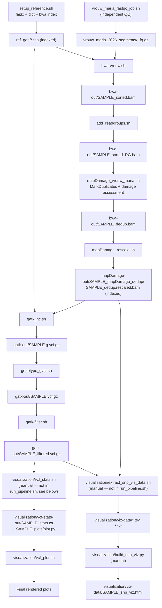

# Pipeline run order

Last verified against the scripts on disk: 2026-08-23.

| # | Script | Reads | Writes | Notes |
|---|--------|-------|--------|-------|
| 1 | `setup_reference.sh` | `ref_gen/*.fna` | `.fai`, `.dict`, `.bwt`/`.pac`/`.ann`/`.amb`/`.sa` | One-time reference prep. `bwa index` now lives here (moved 2026-08-21) instead of running inside every `bwa-vrouw.sh` submission. `run_pipeline.sh` gates both `bwa-vrouw.sh` and `gatk_hc.sh` on this job via `--dependency=afterok`. |
| 2 | `vrouw_maria_fastqc_job.sh` | `vrouw_maria_2026_segments/*.fq.gz` | `fastqc-out/` | QC-only, independent branch — nothing downstream consumes it. |
| 3 | `bwa-vrouw.sh` | `ref_gen/*.fna` (indexed by row 1), `vrouw_maria_2026_segments/*_1.fq.gz`/`_2.fq.gz` | `bwa-out/${SAMPLE}_sorted.bam` (+ `.sai`, `.bai`) | Uses `bwa aln`/`sampe` (backtrack algorithm), the standard choice for short/damaged aDNA reads over `bwa mem`. Now requires row 1 to have completed — enforced via SLURM dependency in `run_pipeline.sh`. |
| 4 | `add_readgroups.sh` | `bwa-out/${SAMPLE}_sorted.bam` | `bwa-out/${SAMPLE}_sorted_RG.bam` | Picard `AddOrReplaceReadGroups`. Moved here (before dedup) 2026-08-22 — Picard's `MarkDuplicates` (row 5) requires `@RG`-tagged input and throws a `NullPointerException` without it; `bwa aln`/`sampe` never adds RG. RG fields (`RGID=1`, `RGPU=unit1`, etc.) are hardcoded placeholders — fine for one sample/one lane, will need to vary per-sample once public comparison accessions are added. |
| 5 | `mapDamage_vrouw_maria.sh` | `bwa-out/${SAMPLE}_sorted_RG.bam` | `bwa-out/${SAMPLE}_dedup.bam` + dup metrics; `mapDamage-out/${SAMPLE}_mapDamage/` | Picard `MarkDuplicates` runs here. Damage-pattern assessment (`mapDamage`, no `--rescale`) runs on the **pre-dedup** RG-tagged BAM, not the dedup one. |
| 6 | `mapDamage_rescale.sh` | `bwa-out/${SAMPLE}_dedup.bam` | `mapDamage-out/${SAMPLE}_mapDamage_dedup/${SAMPLE}_dedup.rescaled.bam` (indexed) | Reruns `mapDamage --rescale` on the deduped BAM to downweight likely-damaged bases in quality scores. RG tags carry through automatically from row 4 (Picard/mapDamage preserve `@RG` header lines). Now indexes its own output (added 2026-08-22) since it feeds `gatk_hc.sh` directly. |
| 7 | `gatk_hc.sh` | `mapDamage-out/${SAMPLE}_mapDamage_dedup/${SAMPLE}_dedup.rescaled.bam`, indexed ref (row 1) | `gatk-out/${SAMPLE}.g.vcf.gz` | HaplotypeCaller in GVCF mode. Depends on both row 1 (ref) and row 6 (rescaled BAM). |
| 8 | `genotype_gvcf.sh` | `gatk-out/${SAMPLE}.g.vcf.gz` | `gatk-out/${SAMPLE}.vcf.gz` | Fine. |
| 9 | `gatk-filter.sh` | `gatk-out/${SAMPLE}.vcf.gz` | `gatk-out/${SAMPLE}_filtered.vcf.gz` | Hard filters on QD/FS/MQ/DP. Fine. |
| 10 | `visualization/vcf_stats.sh` | `gatk-out/${SAMPLE}_filtered.vcf.gz` | `visualization/vcf-stats-out/${SAMPLE}_stats.txt`, `${SAMPLE}_plots/` (incl. `plot.py`) | `bcftools stats` + `plot-vcfstats -P` (the `-P` skips PDF generation — no `pdflatex`/`tectonic` on Roihu). **Run directly on the Roihu login node** (`./vcf_stats.sh SAMPLE`), not via `sbatch` — it's the extraction half of a Roihu/local split; `SAMPLE` is `$1`. |
| 11 | `visualization/vcf_plot.sh` | `visualization/vcf-stats-out/${SAMPLE}_plots/plot.py` | rendered plots | **Runs entirely on a local machine**, not Roihu — needs `plot.py` and the `.dat`/`.png` files from row 10 copied down first. `SAMPLE` is `$1`. Not something this assistant edits/runs from a Roihu session. |
| 12 | `visualization/extract_snp_viz_data.sh` | `gatk-out/${SAMPLE}_filtered.vcf.gz`, `mapDamage-out/${SAMPLE}_mapDamage_dedup/${SAMPLE}_dedup.rescaled.bam` | `visualization/viz-data/${SAMPLE}_snps.tsv`, `${SAMPLE}_coverage_by_contig.txt`, `${SAMPLE}_snp_local_depth.tsv` | Pulls small SNP/coverage/depth extracts for visualization. Needs rows 6 and 9. **Run directly on the Roihu login node**, not via `sbatch` — same reasoning as row 10 (`SAMPLE` is `$1`). |
| 13 | `visualization/build_snp_viz.py` | `visualization/viz-data/*.tsv`, `*.txt` (row 12) | `visualization/viz-data/${SAMPLE}_snp_viz.html` | Builds a standalone interactive HTML page (SNP table, coverage, zoomed depth around top loci; optional NCBI gene annotation, needs network access). **Runs on a local machine**, same as row 11. Its `--viz-data-dir` default is computed relative to the script's own location. Currently single-sample only (`find_sample()` picks the first `*_snps.tsv` found and ignores the rest) — needs a multi-sample rewrite for the planned per-sample-tab dashboard. |

## Known open issues (not fixed in this pass)
- Row 4: read-group fields are single-sample placeholders — revisit when public Typica/Bourbon comparison accessions are added to the pipeline.
- Row 13: `build_snp_viz.py` needs a multi-sample rewrite (one dashboard, per-sample tab/sidebar nav) — deferred to a local-machine session.

## Recently fixed
- 2026-09-03: **All 4 samples now complete through visualization extraction.** Base pipeline verified for all 4 (filtered variant counts: R0002=230, R0003=207, R0004=173, R0005=55 — all confirmed as real VCF content, not just SLURM state). `visualization/extract_snp_viz_data.sh` and `vcf_stats.sh` run for all 4 (directly on the login node, see below) — `visualization/viz-data/*` and `visualization/vcf-stats-out/*_plots/plot.py` exist for every sample. Remaining work (`vcf_plot.sh`, `build_snp_viz.py` multi-sample rewrite) is local-machine, separate session. Note: R0003/R0004 still have their redundant `bwa-out/` intermediates on disk (same ~38GB/sample as R0002/R0005 had before cleanup) — not yet deleted, disk has headroom (47G free) so not urgent.
- 2026-09-03: `/scratch/project_2019675` filled to 100% (250G/250G, 0 free) — `bwa-out/` alone was 171GB because every stage of the alignment chain (`.sai` → `_sorted.bam` → `_sorted_RG.bam` → `_dedup.bam`) keeps a full ~13GB copy, none of it cleaned up once superseded. This is what actually caused R0003/R0004's `MarkDuplicates` to fail (`IOException: Disk quota exceeded`, 99% of the way through writing — a real failure, correctly caught by `set -e` this time, unlike the earlier masked failures). Fix: for samples that reached the final rescaled BAM (R0002, R0005), deleted the now-redundant `.sai`/`_sorted.bam`/`_sorted_RG.bam`/`_dedup.bam` (~38GB/sample) — nothing downstream reads them, only `mapDamage-out/.../*.rescaled.bam` and the `gatk-out/*.vcf.gz` files are load-bearing. Freed ~76GB (`df` needed ~15s to catch up — Lustre quota-accounting lag). R0003/R0004's truncated `_dedup.bam` (confirmed via `samtools quickcheck`) deleted and dedup resubmitted directly (not via `run_pipeline.sh`, to avoid redoing the still-valid `_sorted_RG.bam`). **Not a one-time fix** — this will recur as more samples/reruns accumulate; worth deciding on a real cleanup policy (auto-delete superseded intermediates per stage?) rather than manual cleanup each time.
- 2026-09-03: `visualization/vcf_stats.sh` and `extract_snp_viz_data.sh` were written as `sbatch` job scripts but should run directly on the Roihu login node instead (lightweight, and `vcf_plot.sh`/`build_snp_viz.py` — the actual plotting — run on a local machine, not Roihu, so there was never a reason for the extraction half to go through the SLURM queue). Stripped their `#SBATCH` directives; `vcf_stats.sh` also gained `plot-vcfstats -P` (see row 10).
- 2026-08-23: `bwa-vrouw.sh` hit its 12h `--time` limit for `CT600-007R0003`/`R0004` (killed mid-`samtools sort`, cascading to cancel everything downstream) when all 3 remaining samples' chains ran concurrently — likely cluster contention, since R0002 took 6h24m running mostly alone earlier but R0005 still took 10h30m even in parallel. Both `bwa aln` steps (the actual time sink) had already finished by the time of the kill; only the fast `sampe`/`sort` tail was lost. Fixed: bumped the time limit to 24h, made the `bwa aln` steps skip themselves if their `.sai` output already exists (so a resubmission doesn't repeat hours of already-done alignment work — simple existence check, not a completeness check; delete a `.sai` and rerun if a future timeout happens *during* `bwa aln` itself rather than after). The two truncated `_sorted.bam` files were confirmed corrupt via `samtools quickcheck` ("missing EOF block") and deleted before resubmitting.
- 2026-08-23: Base pipeline (rows 1, 3–9) generalized to all 4 samples — every per-sample script takes `SAMPLE` as `$1`; `run_pipeline.sh` submits `setup_reference.sh`/`vrouw_maria_fastqc_job.sh` once (sample-independent) then loops per-sample parallel chains, and accepts optional sample names on the CLI (`./run_pipeline.sh R0003 R0004`) to target a subset instead of redoing already-completed samples.
- 2026-08-23: R0002 confirmed fully complete end-to-end: `gatk-out/CT600-007R0002_filtered.vcf.gz` verified as a real VCF with 230 records, not just a SLURM-COMPLETED status. In verifying it, found a second instance of the same masking problem — `setup_reference.sh`'s `gatk CreateSequenceDictionary` threw a `PicardException` (`.dict already exists`, from a stale file left by an earlier run) but the script kept going and `bwa index` ran anyway, so the job still reported COMPLETED. Added `set -euo pipefail` to all 13 job scripts (every `.sh` except the sourced `load_modules.sh`) so a real failure now actually stops the job and correctly cancels dependents, instead of silently limping forward like this and the `MarkDuplicates` case below both did. Since `run_pipeline.sh` resubmits `setup_reference.sh` on every run regardless of sample, also made its three steps idempotent (skip if output already exists) — under `set -e`, `CreateSequenceDictionary` erroring on a pre-existing `.dict` would otherwise hard-fail every resubmission.
- 2026-08-22: `mapDamage_vrouw_maria.sh`'s `MarkDuplicates` was failing at runtime with `NullPointerException: ... SAMRecord.getReadGroup() is null` — the pipeline ran `add_readgroups.sh` *after* dedup instead of before it, so `MarkDuplicates` never saw `@RG`-tagged input. Reordered: `bwa-vrouw.sh` → `add_readgroups.sh` → `mapDamage_vrouw_maria.sh` → `mapDamage_rescale.sh` → `gatk_hc.sh` (rows 3–7 above), `run_pipeline.sh`'s dependency chain updated to match. This is why the previous full-pipeline run (`ref-setup`/`fastqc`/`bwa-vrouw`/dedup all showed SLURM state COMPLETED) still produced no filtered VCF — `MarkDuplicates` failing didn't make the *script* exit non-zero.
- 2026-08-22: `ref_gen/` was missing the actual reference fasta entirely (only a stray, incomplete `.dict` left over from a failed run). Fetched `GCF_036785885.1_Coffea_Arabica_ET-39_HiFi_genomic.fna` from NCBI RefSeq directly (no `datasets` CLI module on Roihu), MD5-verified against NCBI's checksum.
- 2026-08-22: All 8 raw read files under `vrouw_maria_2026_segments/` were actually directories, left over from an incomplete Allas/Swift large-object transfer (each `*.fq.gz` "file" contained numbered byte segments instead of the real file). Reconstructed via ordered concatenation, verified with `gzip -t` on every file before removing the original segment directories.
- 2026-08-22: Row 2 vs. row 3 directory name mismatch fixed — `bwa-vrouw.sh` now reads from `vrouw_maria_2026_segments/` (the directory that actually exists and is what `vrouw_maria_fastqc_job.sh` already used), not the never-present `vrouw_maria_2026/`.
- 2026-08-22: Root cause of the `gatk`/`samtools`/`bwa`/`fastqc`/`picard` "requires a toolchain that is incompatible with the currently loaded environment" errors found and fixed: Roihu's login/job shells auto-load a default `StdEnv` toolchain (gcc/openmpi/ucx/openblas) that conflicts with `bio-apps/v202603`. `load_modules.sh` is now a sourced helper (`module purge` + `module load bio-apps/v202603`) used by every job script, each of which now also pins exact tool versions instead of bare names. Verified against `module spider` output and by actually loading each tool.
- 2026-08-22: `extract_snp_viz_data.sh` and `vcf_stats.sh` were loading `module load biokit`, which doesn't exist on Roihu (a Puhti-era module name) — switched to `bcftools/1.23.1` + `samtools/1.21`.
- 2026-08-22: `mapDamage_rescale.sh` / `mapDamage_vrouw_maria.sh` requested `mapdamage2/2.2.2`, which doesn't exist on Roihu — corrected to `mapdamage2/2.2.3`.
- 2026-08-22: Visualization scripts/data (`vcf_stats.sh`, `vcf_plot.sh`, `extract_snp_viz_data.sh`, `build_snp_viz.py`, `viz-data/`, `vcf-stats-out/`) moved into `visualization/`, and dropped from `run_pipeline.sh`'s SLURM dependency chain until the base analysis is verified end-to-end. `vcf_plot.sh`'s hardcoded `cd` path (missing `the_coffee_wrecks/`) was fixed as part of the move.
- 2026-08-21: `bwa index` moved out of `bwa-vrouw.sh` (was re-run on every alignment submission) into `setup_reference.sh` as a one-time step; `run_pipeline.sh` updated so `bwa-vrouw.sh` now waits on `setup_reference.sh` via `--dependency=afterok`.
- Reference indexing (`faidx`/`CreateSequenceDictionary`) living in `gatk_hc.sh` — already moved to `setup_reference.sh` in an earlier session.
- `bwa-vrouw.sh` writing output to the wrong directory (no `bwa-out/` prefix) — already fixed in the current script.
- `mapDamage_vrouw_maria.sh`'s `MarkDuplicates` block being commented out — already fixed in the current script.
- Duplicate `vcf_stats.sh`/`vcf-stats.sh` pair — only one file exists now.
