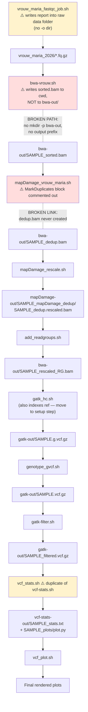

```mermaid
flowchart TD
    Z["vrouw_maria_fastqc_job.sh\n⚠️ writes report into raw data folder\n(no -o dir)"] -.-> RAW["vrouw_maria_2026/*.fq.gz"]
    RAW --> A["bwa-vrouw.sh\n⚠️ writes sorted.bam to cwd,\nNOT to bwa-out/"]
    A -.-|"BROKEN PATH:\nno mkdir -p bwa-out,\nno output prefix"| B["bwa-out/SAMPLE_sorted.bam"]
    B --> C["mapDamage_vrouw_maria.sh\n⚠️ MarkDuplicates block commented out"]
    C -.-|"BROKEN LINK:\ndedup.bam never created"| D["bwa-out/SAMPLE_dedup.bam"]
    D --> E["mapDamage_rescale.sh"]
    E --> F["mapDamage-out/SAMPLE_mapDamage_dedup/\nSAMPLE_dedup.rescaled.bam"]
    F --> G["add_readgroups.sh"]
    G --> H["bwa-out/SAMPLE_rescaled_RG.bam"]
    H --> I["gatk_hc.sh\n(also indexes ref — move to setup step)"]
    I --> J["gatk-out/SAMPLE.g.vcf.gz"]
    J --> K["genotype_gvcf.sh"]
    K --> L["gatk-out/SAMPLE.vcf.gz"]
    L --> M["gatk-filter.sh"]
    M --> N["gatk-out/SAMPLE_filtered.vcf.gz"]
    N --> O["vcf_stats.sh ⚠️ duplicate of vcf-stats.sh"]
    O --> P["vcf-stats-out/SAMPLE_stats.txt\n+ SAMPLE_plots/plot.py"]
    P --> Q["vcf_plot.sh"]
    Q --> R["Final rendered plots"]

    style A fill:#ffdddd
    style C fill:#ffdddd
    style O fill:#fff3cd
    style Z fill:#fff3cd

```

