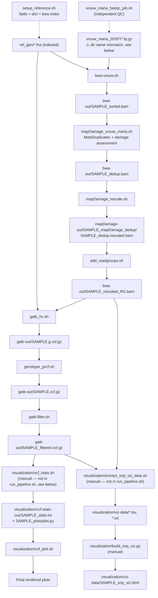

# Pipeline run order

Last verified against the scripts on disk: 2026-08-21.

| # | Script | Reads | Writes | Notes |
|---|--------|-------|--------|-------|
| 1 | `setup_reference.sh` | `ref_gen/*.fna` | `.fai`, `.dict`, `.bwt`/`.pac`/`.ann`/`.amb`/`.sa` | One-time reference prep. `bwa index` now lives here (moved 2026-08-21) instead of running inside every `bwa-vrouw.sh` submission. `run_pipeline.sh` gates both `bwa-vrouw.sh` and `gatk_hc.sh` on this job via `--dependency=afterok`. |
| 2 | `vrouw_maria_fastqc_job.sh` | `vrouw_maria_2026_segments/*.fq.gz` | `fastqc-out/` | QC-only, independent branch — nothing downstream consumes it. ⚠️ Reads from `vrouw_maria_2026_segments/`, while `bwa-vrouw.sh` (row 3) reads from `vrouw_maria_2026/` — different directory names. Confirm which is the intended raw-reads location; not changed here since the correct one wasn't obvious from the scripts alone. |
| 3 | `bwa-vrouw.sh` | `ref_gen/*.fna` (indexed by row 1), `vrouw_maria_2026/*_1.fq.gz`/`_2.fq.gz` | `bwa-out/${SAMPLE}_sorted.bam` (+ `.sai`, `.bai`) | Uses `bwa aln`/`sampe` (backtrack algorithm), the standard choice for short/damaged aDNA reads over `bwa mem`. Now requires row 1 to have completed — enforced via SLURM dependency in `run_pipeline.sh`. |
| 4 | `mapDamage_vrouw_maria.sh` | `bwa-out/${SAMPLE}_sorted.bam` | `bwa-out/${SAMPLE}_dedup.bam` + dup metrics; `mapDamage-out/${SAMPLE}_mapDamage/` | Picard `MarkDuplicates` runs here (this was previously broken/commented-out per an older version of this doc — verified fixed in the current script). Damage-pattern assessment (`mapDamage`, no `--rescale`) runs on the **pre-dedup** sorted BAM, not the dedup one. |
| 5 | `mapDamage_rescale.sh` | `bwa-out/${SAMPLE}_dedup.bam` | `mapDamage-out/${SAMPLE}_mapDamage_dedup/${SAMPLE}_dedup.rescaled.bam` | Reruns `mapDamage --rescale` on the deduped BAM to downweight likely-damaged bases in quality scores. |
| 6 | `add_readgroups.sh` | `mapDamage-out/.../${SAMPLE}_dedup.rescaled.bam` | `bwa-out/${SAMPLE}_rescaled_RG.bam` | Picard `AddOrReplaceReadGroups`. RG fields (`RGID=1`, `RGPU=unit1`, etc.) are hardcoded placeholders — fine for one sample/one lane, will need to vary per-sample once public comparison accessions are added. |
| 7 | `gatk_hc.sh` | `bwa-out/${SAMPLE}_rescaled_RG.bam`, indexed ref (row 1) | `gatk-out/${SAMPLE}.g.vcf.gz` | HaplotypeCaller in GVCF mode. Depends on both row 1 (ref) and row 6 (RG-tagged BAM). |
| 8 | `genotype_gvcf.sh` | `gatk-out/${SAMPLE}.g.vcf.gz` | `gatk-out/${SAMPLE}.vcf.gz` | Fine. |
| 9 | `gatk-filter.sh` | `gatk-out/${SAMPLE}.vcf.gz` | `gatk-out/${SAMPLE}_filtered.vcf.gz` | Hard filters on QD/FS/MQ/DP. Fine. |
| 10 | `visualization/vcf_stats.sh` | `gatk-out/${SAMPLE}_filtered.vcf.gz` | `visualization/vcf-stats-out/${SAMPLE}_stats.txt`, `${SAMPLE}_plots/` | `bcftools stats` + `plot-vcfstats`. Moved into `visualization/` 2026-08-22 and dropped from `run_pipeline.sh`'s dependency chain — visualization is run manually once the base analysis (through `gatk-filter.sh`) has been verified. |
| 11 | `visualization/vcf_plot.sh` | `visualization/vcf-stats-out/${SAMPLE}_plots/plot.py` | rendered plots | Moved into `visualization/` 2026-08-22; the hardcoded `cd` path (previously missing the `the_coffee_wrecks/` segment) is fixed. Also dropped from `run_pipeline.sh` for now, same reason as row 10. |
| 12 | `visualization/extract_snp_viz_data.sh` | `gatk-out/${SAMPLE}_filtered.vcf.gz`, `bwa-out/${SAMPLE}_rescaled_RG.bam` | `visualization/viz-data/${SAMPLE}_snps.tsv`, `${SAMPLE}_coverage_by_contig.txt`, `${SAMPLE}_snp_local_depth.tsv` | Pulls small SNP/coverage/depth extracts for visualization. Needs rows 6 and 9. Not wired into `run_pipeline.sh` — run manually. |
| 13 | `visualization/build_snp_viz.py` | `visualization/viz-data/*.tsv`, `*.txt` (row 12) | `visualization/viz-data/${SAMPLE}_snp_viz.html` | Builds a standalone interactive HTML page (SNP table, coverage, zoomed depth around top loci; optional NCBI gene annotation, needs network access). Run manually, e.g. on a login node with `module load python-data`. Its `--viz-data-dir` default is computed relative to the script's own location, so it needed no code change for the move. |

## Known open issues (not fixed in this pass)
- Row 2 vs. row 3: raw-reads directory name mismatch (`vrouw_maria_2026_segments/` vs `vrouw_maria_2026/`).
- Row 6: read-group fields are single-sample placeholders — revisit when public Typica/Bourbon comparison accessions are added to the pipeline.

## Recently fixed
- 2026-08-22: Root cause of the `gatk`/`samtools`/`bwa`/`fastqc`/`picard` "requires a toolchain that is incompatible with the currently loaded environment" errors found and fixed: Roihu's login/job shells auto-load a default `StdEnv` toolchain (gcc/openmpi/ucx/openblas) that conflicts with `bio-apps/v202603`. `load_modules.sh` is now a sourced helper (`module purge` + `module load bio-apps/v202603`) used by every job script, each of which now also pins exact tool versions instead of bare names. Verified against `module spider` output and by actually loading each tool.
- 2026-08-22: `extract_snp_viz_data.sh` and `vcf_stats.sh` were loading `module load biokit`, which doesn't exist on Roihu (a Puhti-era module name) — switched to `bcftools/1.23.1` + `samtools/1.21`.
- 2026-08-22: `mapDamage_rescale.sh` / `mapDamage_vrouw_maria.sh` requested `mapdamage2/2.2.2`, which doesn't exist on Roihu — corrected to `mapdamage2/2.2.3`.
- 2026-08-22: Visualization scripts/data (`vcf_stats.sh`, `vcf_plot.sh`, `extract_snp_viz_data.sh`, `build_snp_viz.py`, `viz-data/`, `vcf-stats-out/`) moved into `visualization/`, and dropped from `run_pipeline.sh`'s SLURM dependency chain until the base analysis is verified end-to-end. `vcf_plot.sh`'s hardcoded `cd` path (missing `the_coffee_wrecks/`) was fixed as part of the move.
- 2026-08-21: `bwa index` moved out of `bwa-vrouw.sh` (was re-run on every alignment submission) into `setup_reference.sh` as a one-time step; `run_pipeline.sh` updated so `bwa-vrouw.sh` now waits on `setup_reference.sh` via `--dependency=afterok`.
- Reference indexing (`faidx`/`CreateSequenceDictionary`) living in `gatk_hc.sh` — already moved to `setup_reference.sh` in an earlier session.
- `bwa-vrouw.sh` writing output to the wrong directory (no `bwa-out/` prefix) — already fixed in the current script.
- `mapDamage_vrouw_maria.sh`'s `MarkDuplicates` block being commented out — already fixed in the current script.
- Duplicate `vcf_stats.sh`/`vcf-stats.sh` pair — only one file exists now.
