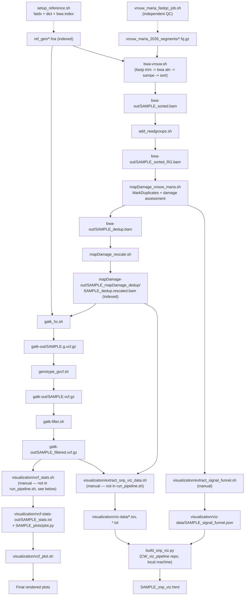

# Pipeline run order

Last verified against the scripts on disk: 2026-09-19.

| # | Script | Reads | Writes | Notes |
|---|--------|-------|--------|-------|
| 1 | `setup_reference.sh` | `ref_gen/*.fna` | `.fai`, `.dict`, `.bwt`/`.pac`/`.ann`/`.amb`/`.sa` | One-time reference prep. `bwa index` now lives here (moved 2026-08-21) instead of running inside every `bwa-vrouw.sh` submission. `run_pipeline.sh` gates both `bwa-vrouw.sh` and `gatk_hc.sh` on this job via `--dependency=afterok`. |
| 2 | `vrouw_maria_fastqc_job.sh` | `vrouw_maria_2026_segments/*.fq.gz` | `fastqc-out/` | QC-only, independent branch — nothing downstream consumes it. |
| 3 | `bwa-vrouw.sh` | `ref_gen/*.fna` (indexed by row 1), `vrouw_maria_2026_segments/*_1.fq.gz`/`_2.fq.gz` | `bwa-out/${SAMPLE}_sorted.bam` (+ `.sai`, `.bai`) | `fastp` adapter/quality trim (added 2026-09-19, see below) then `bwa aln`/`sampe` (backtrack algorithm), the standard choice for short/damaged aDNA reads over `bwa mem` — see "bwa aln parameters" below for why `-l 16500 -n 0.01` specifically. Now requires row 1 to have completed — enforced via SLURM dependency in `run_pipeline.sh`. Deletes its trimmed-fastq intermediates once `sorted.bam` is confirmed written (keeps `.sai` for resumability — see "Intermediate cleanup policy" below). |
| 4 | `add_readgroups.sh` | `bwa-out/${SAMPLE}_sorted.bam` | `bwa-out/${SAMPLE}_sorted_RG.bam` | Picard `AddOrReplaceReadGroups`. Moved here (before dedup) 2026-08-22 — Picard's `MarkDuplicates` (row 5) requires `@RG`-tagged input and throws a `NullPointerException` without it; `bwa aln`/`sampe` never adds RG. RG fields (`RGID=1`, `RGPU=unit1`, etc.) are hardcoded placeholders — fine for one sample/one lane, will need to vary per-sample once public comparison accessions are added. Deletes `sorted.bam` once `sorted_RG.bam` is confirmed written. |
| 5 | `mapDamage_vrouw_maria.sh` | `bwa-out/${SAMPLE}_sorted_RG.bam` | `bwa-out/${SAMPLE}_dedup.bam` + dup metrics; `mapDamage-out/${SAMPLE}_mapDamage/` | Picard `MarkDuplicates` runs here. Damage-pattern assessment (`mapDamage`, no `--rescale`) runs on the **pre-dedup** RG-tagged BAM, not the dedup one. Deletes `sorted_RG.bam` once both steps above have used it and `dedup.bam` is confirmed written. |
| 6 | `mapDamage_rescale.sh` | `bwa-out/${SAMPLE}_dedup.bam` | `mapDamage-out/${SAMPLE}_mapDamage_dedup/${SAMPLE}_dedup.rescaled.bam` (indexed) | Reruns `mapDamage --rescale` on the deduped BAM to downweight likely-damaged bases in quality scores. RG tags carry through automatically from row 4 (Picard/mapDamage preserve `@RG` header lines). Now indexes its own output (added 2026-08-22) since it feeds `gatk_hc.sh` directly. Deletes `dedup.bam` once `rescaled.bam` is confirmed written and indexed. |
| 7 | `gatk_hc.sh` | `mapDamage-out/${SAMPLE}_mapDamage_dedup/${SAMPLE}_dedup.rescaled.bam`, indexed ref (row 1) | `gatk-out/${SAMPLE}.g.vcf.gz` | HaplotypeCaller in GVCF mode. Depends on both row 1 (ref) and row 6 (rescaled BAM). |
| 8 | `genotype_gvcf.sh` | `gatk-out/${SAMPLE}.g.vcf.gz` | `gatk-out/${SAMPLE}.vcf.gz` | Fine. |
| 9 | `gatk-filter.sh` | `gatk-out/${SAMPLE}.vcf.gz` | `gatk-out/${SAMPLE}_filtered.vcf.gz` | Hard filters on QD/FS/MQ/DP. Fine. |
| 10 | `visualization/vcf_stats.sh` | `gatk-out/${SAMPLE}_filtered.vcf.gz` | `visualization/vcf-stats-out/${SAMPLE}_stats.txt`, `${SAMPLE}_plots/` (incl. `plot.py`) | `bcftools stats` + `plot-vcfstats -P` (the `-P` skips PDF generation — no `pdflatex`/`tectonic` on Roihu). **Run directly on the Roihu login node** (`./vcf_stats.sh SAMPLE`), not via `sbatch` — it's the extraction half of a Roihu/local split; `SAMPLE` is `$1`. |
| 11 | `visualization/vcf_plot.sh` | `visualization/vcf-stats-out/${SAMPLE}_plots/plot.py` | rendered plots | **Runs entirely on a local machine**, not Roihu — needs `plot.py` and the `.dat`/`.png` files from row 10 copied down first. `SAMPLE` is `$1`. Not something this assistant edits/runs from a Roihu session. |
| 12 | `visualization/extract_snp_viz_data.sh` | `gatk-out/${SAMPLE}_filtered.vcf.gz`, `mapDamage-out/${SAMPLE}_mapDamage_dedup/${SAMPLE}_dedup.rescaled.bam` | `visualization/viz-data/${SAMPLE}_snps.tsv`, `${SAMPLE}_coverage_by_contig.txt`, `${SAMPLE}_snp_local_depth.tsv` | Pulls small SNP/coverage/depth extracts for visualization. Needs rows 6 and 9. **Run directly on the Roihu login node**, not via `sbatch` — same reasoning as row 10 (`SAMPLE` is `$1`). |
| 13 | `visualization/extract_signal_funnel.sh` | `mapDamage-out/${SAMPLE}_dup_metrics.txt` (written by row 5) | `visualization/viz-data/${SAMPLE}_signal_funnel.json` | Added 2026-09-15. Computes the read-attrition funnel (raw → mapped → unique-after-dedup) purely from `dup_metrics.txt`'s own fields — no dependency on `bwa-vrouw.sh`'s old flagstat job logs, which aren't guaranteed to persist. See "Sample QC: signal/coverage funnel" below for what this data means. **Run directly on the Roihu login node**, same as row 12. |
| 14 | `build_snp_viz.py` | `visualization/viz-data/*.tsv`, `*.txt`, `*.json` (rows 12–13, copied down) | `${SAMPLE}_snp_viz.html` | **Moved 2026-09-03 to a separate standalone repo, `CW_viz_pipeline`** — no longer lives under `visualization/` here. Builds a standalone interactive HTML page (SNP table, coverage, zoomed depth around top loci; optional NCBI gene annotation). **Runs on a local machine**, same as row 11, in a separate Claude Code session against that repo. Currently single-sample only (`find_sample()` picks the first `*_snps.tsv` found and ignores the rest) — needs a multi-sample rewrite for the planned per-sample-tab dashboard, and now also needs to read/render the new `*_signal_funnel.json` from row 13. |

## Known open issues (not fixed in this pass)
- Row 4: read-group fields are single-sample placeholders — revisit when public Typica/Bourbon comparison accessions are added to the pipeline.
- Row 14: `build_snp_viz.py` (now in `CW_viz_pipeline`) needs a multi-sample rewrite (one dashboard, per-sample tab/sidebar nav) and to render the new `*_signal_funnel.json` (row 13) — deferred to a local-machine session.
- Row 3: `bwa-vrouw.sh` doesn't set `-o 2` (extra gap open), which Oliva et al. 2021 found beneficial alongside `-l`/`-n` for aDNA — see "bwa aln parameters" below. Worth considering, not yet changed.

## Intermediate cleanup policy

Rows 3, 4, 5, 6 each delete their own large (multi-GB) BAM input once the next stage's output is confirmed written — added 2026-09-19 after the project hit disk-quota exhaustion **twice** (2026-09-03, 2026-09-19) from exactly the same cause: 4 parallel sample chains each keeping every stage's BAM alive simultaneously. `set -e` on every script means a cleanup line is only ever reached if everything before it succeeded, so this doesn't need extra existence checks. `.sai` files are deliberately kept (not cleaned up) — they're what let `bwa-vrouw.sh` skip repeating the expensive `bwa aln` step on resubmission after a timeout (see row 3's own 2026-08-23 history). One consequence: a full rerun of an *already-completed* sample (not just resubmission after a failure) needs its `.sai` deleted manually first, since `bwa sampe` needs the trimmed-fastq intermediates that get cleaned up alongside `sorted.bam` — see `bwa-vrouw.sh`'s own comments.

Also found and cleaned up while doing this (2026-09-19): ~26GB of orphaned `samtools sort` temp chunk files (`*_sorted.bam.tmp.NNNN.bam`) left behind by the original 2026-08-23 12h-timeout incident — `samtools sort` normally deletes these itself on successful completion, but the job was killed mid-sort and never got the chance. Not something the cleanup policy above prevents (it only runs on success), but worth knowing these can accumulate silently after any future timeout/kill during a `samtools sort`.

## Sample QC: signal/coverage funnel

**Finding (2026-09-15):** the very low final coverage (0.0014–0.004× mean depth across all 4 samples) is *not* the pipeline losing signal across processing stages — it's almost entirely explained by two things that happen immediately at alignment and deduplication:

| Sample | Raw reads | Mapped (endogenous) | Unique after dedup | Est. library size | Final mean depth |
|---|---:|---:|---:|---:|---:|
| R0002 | 222,126,906 | 1,277,486 (0.575%) | 4,804 (0.0022% of raw) | 2,808 | 0.00342× |
| R0003 | 213,781,012 | 1,666,557 (0.780%) | 3,426 (0.0016% of raw) | 1,314 | 0.00339× |
| R0004 | 222,830,583 | 2,031,668 (0.912%) | 3,777 (0.0017% of raw) | 1,588 | 0.00403× |
| R0005 | 220,496,492 | 1,746,054 (0.792%) | 2,512 (0.0011% of raw) | 918 | 0.00144× |

- **Alignment loses 99–99.4%:** under 1% of raw reads map to *Coffea arabica* at all — the rest is environmental/microbial DNA, unsurprising for a shipwreck-recovered sample sequenced without target enrichment. This endogenous rate is low even by ancient-DNA standards.
- **Deduplication loses another 99.6–99.9% of what's left:** Picard's `ESTIMATED_LIBRARY_SIZE` — the number of *distinct original DNA molecules* ever captured during extraction/library prep — is only 918–2,808 per sample. Everything mapped is hundreds of redundant copies of that same tiny pool. This is a **library-complexity ceiling, not a sequencing-depth problem**: resequencing the existing libraries deeper would not raise coverage meaningfully, since the extra reads would just be more copies of the same ~1,000–3,000 molecules.

**What would actually increase coverage** (wet-lab changes, not something fixable in this pipeline):
1. **In-solution target capture/enrichment** against the *Coffea* genome before sequencing, to raise the endogenous fraction — this is the standard published approach for low-endogenous-content aDNA and directly addresses the alignment-stage bottleneck.
2. **A new extraction/library prep from more or fresher starting material**, if any remains — library complexity is set at extraction+library-prep time, not at sequencing time, so this is the only lever that raises `ESTIMATED_LIBRARY_SIZE` itself.
3. Minimizing PCR cycles in any future library prep reduces artificial duplicate inflation, but with starting complexity this low it's a minor lever next to (1)/(2).

**Extracted per-sample** by `visualization/extract_signal_funnel.sh` (row 13) into `visualization/viz-data/${SAMPLE}_signal_funnel.json`, computed straight from `dup_metrics.txt` — no dependency on old job logs.

## bwa aln parameters

`bwa-vrouw.sh` uses `bwa aln -l 16500 -n 0.01` (backtrack algorithm, not `bwa mem`). Both choices trace to published aDNA-mapping literature, not arbitrary defaults:

- **Why disable the seed (`-l` set far larger than any read length):** Schubert et al. (2012), *"Improving ancient DNA read mapping against modern reference genomes,"* BMC Genomics 13:178 ([DOI](https://doi.org/10.1186/1471-2164-13-178)) — post-mortem cytosine deamination concentrates mismatches at read termini, but bwa aln's default 32bp seed tolerates only ~2 mismatches and is assumed low-error, so genuinely ancient/damaged reads get rejected before the full-read alignment score is even considered. Setting `-l` larger than the read length disables the seed heuristic entirely, recovering those reads. (This pipeline's `-l 16500` and the more commonly-cited `-l 1024` are functionally identical here — both simply exceed every actual read length, and either works.)
- **Why `-n 0.01` (relaxed edit-distance threshold) and the wider recipe:** Oliva, Tobler, Llamas & Souilmi (2021), *"Additional evaluations show that specific BWA-aln settings still outperform BWA-mem for ancient DNA data alignment,"* Ecology and Evolution ([PMC8717315](https://pmc.ncbi.nlm.nih.gov/articles/PMC8717315/)) — benchmarks `bwa aln -l 1024 -n 0.01 -o 2` directly against `bwa mem` on aDNA-length (30–60bp) reads and finds bwa-aln maintains a small but consistent precision/mapping-rate edge, reducing reference bias in downstream variant calling — the reason this whole pipeline uses `bwa aln`/`sampe` over the far more common `bwa mem` for modern data.
- **Discrepancy worth noting:** this pipeline doesn't set `-o 2` (extra permitted gap open), which both papers' most-validated parameterization includes alongside `-n 0.01`. Not necessarily wrong — Oliva et al.'s simpler `-l 1024`-only variant (no `-n`/`-o` changes) also outperformed `bwa mem`, just by a smaller margin — but adding `-o 2` would align this pipeline with the more rigorously benchmarked setting.

## Recently fixed
- 2026-09-21: **All 4 samples now complete through the updated (fastp-trimmed, LENIENT-validated) pipeline**, verified as real VCF content: R0002=233, R0003=209, R0004=208, R0005=63 filtered variants. Every sample shows the same consistent pattern vs. the pre-trimming baseline — meaningfully higher effective library complexity (`ESTIMATED_LIBRARY_SIZE` up 66–161%), not just cleaner alignment. `visualization/viz-data/` and `vcf-stats-out/` updated and committed for all 4 (see git log for the exact before/after numbers). `run_pipeline.sh --serial` (below) is what got this to a clean run without a 4th disk-quota crisis.
- 2026-09-21: `run_pipeline.sh --serial` (added the day before) fixed the disk-quota problem, but R0003 then hit a new, real failure: Picard's `AddOrReplaceReadGroups` threw `SAM validation error: INVALID_MAPPING_QUALITY ... MAPQ should be 0 for unmapped read` under its default STRICT validation. Root cause: `bwa sampe` can occasionally emit an unmapped read with a stale nonzero MAPQ — a known rough edge of that (legacy, but correct-for-aDNA) aligner — and this dataset's unusually non-standard pairing (~0.003% properly paired, see "Sample QC: signal/coverage funnel") makes it more likely to surface than in typical data. R0002 didn't hit it (different alignment data), R0003 did — not a regression from that day's other changes, just data-dependent. Fixed by adding `VALIDATION_STRINGENCY=LENIENT` to both Picard steps (`add_readgroups.sh`'s `AddOrReplaceReadGroups`, `mapDamage_vrouw_maria.sh`'s `MarkDuplicates`) — the standard, correct mitigation for this class of aligner-output quirk, not a workaround.
- 2026-09-19: Added `fastp` adapter/quality trimming to `bwa-vrouw.sh` (row 3), and the auto-cleanup policy across rows 3–6 (see "Intermediate cleanup policy" above) — both prompted by findings from the `CW_metagenomic_screening` side-project (see its `LABDIARY.md`), which also concluded the base pipeline's alignment is correctly excluding non-endogenous reads (no missed coffee signal to recover via different parameters). Also cleaned up ~26GB of orphaned `samtools sort` temp files left over from the original 2026-08-23 timeout. All 4 samples' base pipeline resubmitted with the trimming step via `run_pipeline.sh`.
- 2026-09-15: Added `visualization/extract_signal_funnel.sh` (row 13) and the "Sample QC: signal/coverage funnel" + "bwa aln parameters" sections above, after the user asked why coverage was so low — traced to endogenous-DNA rate and library complexity (not a pipeline bug), with citations for the `bwa aln -l/-n` choice.
- 2026-09-03: **All 4 samples now complete through visualization extraction.** Base pipeline verified for all 4 (filtered variant counts: R0002=230, R0003=207, R0004=173, R0005=55 — all confirmed as real VCF content, not just SLURM state). `visualization/extract_snp_viz_data.sh` and `vcf_stats.sh` run for all 4 (directly on the login node, see below) — `visualization/viz-data/*` and `visualization/vcf-stats-out/*_plots/plot.py` exist for every sample. Remaining work (`vcf_plot.sh`, `build_snp_viz.py` multi-sample rewrite) is local-machine, separate session. Note: R0003/R0004 still have their redundant `bwa-out/` intermediates on disk (same ~38GB/sample as R0002/R0005 had before cleanup) — not yet deleted, disk has headroom (47G free) so not urgent.
- 2026-09-03: `/scratch/project_2019675` filled to 100% (250G/250G, 0 free) — `bwa-out/` alone was 171GB because every stage of the alignment chain (`.sai` → `_sorted.bam` → `_sorted_RG.bam` → `_dedup.bam`) keeps a full ~13GB copy, none of it cleaned up once superseded. This is what actually caused R0003/R0004's `MarkDuplicates` to fail (`IOException: Disk quota exceeded`, 99% of the way through writing — a real failure, correctly caught by `set -e` this time, unlike the earlier masked failures). Fix: for samples that reached the final rescaled BAM (R0002, R0005), deleted the now-redundant `.sai`/`_sorted.bam`/`_sorted_RG.bam`/`_dedup.bam` (~38GB/sample) — nothing downstream reads them, only `mapDamage-out/.../*.rescaled.bam` and the `gatk-out/*.vcf.gz` files are load-bearing. Freed ~76GB (`df` needed ~15s to catch up — Lustre quota-accounting lag). R0003/R0004's truncated `_dedup.bam` (confirmed via `samtools quickcheck`) deleted and dedup resubmitted directly (not via `run_pipeline.sh`, to avoid redoing the still-valid `_sorted_RG.bam`). **Not a one-time fix** — this will recur as more samples/reruns accumulate; worth deciding on a real cleanup policy (auto-delete superseded intermediates per stage?) rather than manual cleanup each time.
- 2026-09-03: `visualization/vcf_stats.sh` and `extract_snp_viz_data.sh` were written as `sbatch` job scripts but should run directly on the Roihu login node instead (lightweight, and `vcf_plot.sh`/`build_snp_viz.py` — the actual plotting — run on a local machine, not Roihu, so there was never a reason for the extraction half to go through the SLURM queue). Stripped their `#SBATCH` directives; `vcf_stats.sh` also gained `plot-vcfstats -P` (see row 10).
- 2026-08-23: `bwa-vrouw.sh` hit its 12h `--time` limit for `CT600-007R0003`/`R0004` (killed mid-`samtools sort`, cascading to cancel everything downstream) when all 3 remaining samples' chains ran concurrently — likely cluster contention, since R0002 took 6h24m running mostly alone earlier but R0005 still took 10h30m even in parallel. Both `bwa aln` steps (the actual time sink) had already finished by the time of the kill; only the fast `sampe`/`sort` tail was lost. Fixed: bumped the time limit to 24h, made the `bwa aln` steps skip themselves if their `.sai` output already exists (so a resubmission doesn't repeat hours of already-done alignment work — simple existence check, not a completeness check; delete a `.sai` and rerun if a future timeout happens *during* `bwa aln` itself rather than after). The two truncated `_sorted.bam` files were confirmed corrupt via `samtools quickcheck` ("missing EOF block") and deleted before resubmitting.
- 2026-08-23: Base pipeline (rows 1, 3–9) generalized to all 4 samples — every per-sample script takes `SAMPLE` as `$1`; `run_pipeline.sh` submits `setup_reference.sh`/`vrouw_maria_fastqc_job.sh` once (sample-independent) then loops per-sample parallel chains, and accepts optional sample names on the CLI (`./run_pipeline.sh R0003 R0004`) to target a subset instead of redoing already-completed samples.
- 2026-08-23: R0002 confirmed fully complete end-to-end: `gatk-out/CT600-007R0002_filtered.vcf.gz` verified as a real VCF with 230 records, not just a SLURM-COMPLETED status. In verifying it, found a second instance of the same masking problem — `setup_reference.sh`'s `gatk CreateSequenceDictionary` threw a `PicardException` (`.dict already exists`, from a stale file left by an earlier run) but the script kept going and `bwa index` ran anyway, so the job still reported COMPLETED. Added `set -euo pipefail` to all 13 job scripts (every `.sh` except the sourced `load_modules.sh`) so a real failure now actually stops the job and correctly cancels dependents, instead of silently limping forward like this and the `MarkDuplicates` case below both did. Since `run_pipeline.sh` resubmits `setup_reference.sh` on every run regardless of sample, also made its three steps idempotent (skip if output already exists) — under `set -e`, `CreateSequenceDictionary` erroring on a pre-existing `.dict` would otherwise hard-fail every resubmission.
- 2026-08-22: `mapDamage_vrouw_maria.sh`'s `MarkDuplicates` was failing at runtime with `NullPointerException: ... SAMRecord.getReadGroup() is null` — the pipeline ran `add_readgroups.sh` *after* dedup instead of before it, so `MarkDuplicates` never saw `@RG`-tagged input. Reordered: `bwa-vrouw.sh` → `add_readgroups.sh` → `mapDamage_vrouw_maria.sh` → `mapDamage_rescale.sh` → `gatk_hc.sh` (rows 3–7 above), `run_pipeline.sh`'s dependency chain updated to match. This is why the previous full-pipeline run (`ref-setup`/`fastqc`/`bwa-vrouw`/dedup all showed SLURM state COMPLETED) still produced no filtered VCF — `MarkDuplicates` failing didn't make the *script* exit non-zero.
- 2026-08-22: `ref_gen/` was missing the actual reference fasta entirely (only a stray, incomplete `.dict` left over from a failed run). Fetched `GCF_036785885.1_Coffea_Arabica_ET-39_HiFi_genomic.fna` from NCBI RefSeq directly (no `datasets` CLI module on Roihu), MD5-verified against NCBI's checksum.
- 2026-08-22: All 8 raw read files under `vrouw_maria_2026_segments/` were actually directories, left over from an incomplete Allas/Swift large-object transfer (each `*.fq.gz` "file" contained numbered byte segments instead of the real file). Reconstructed via ordered concatenation, verified with `gzip -t` on every file before removing the original segment directories.
- 2026-08-22: Row 2 vs. row 3 directory name mismatch fixed — `bwa-vrouw.sh` now reads from `vrouw_maria_2026_segments/` (the directory that actually exists and is what `vrouw_maria_fastqc_job.sh` already used), not the never-present `vrouw_maria_2026/`.
- 2026-08-22: Root cause of the `gatk`/`samtools`/`bwa`/`fastqc`/`picard` "requires a toolchain that is incompatible with the currently loaded environment" errors found and fixed: Roihu's login/job shells auto-load a default `StdEnv` toolchain (gcc/openmpi/ucx/openblas) that conflicts with `bio-apps/v202603`. `load_modules.sh` is now a sourced helper (`module purge` + `module load bio-apps/v202603`) used by every job script, each of which now also pins exact tool versions instead of bare names. Verified against `module spider` output and by actually loading each tool.
- 2026-08-22: `extract_snp_viz_data.sh` and `vcf_stats.sh` were loading `module load biokit`, which doesn't exist on Roihu (a Puhti-era module name) — switched to `bcftools/1.23.1` + `samtools/1.21`.
- 2026-08-22: `mapDamage_rescale.sh` / `mapDamage_vrouw_maria.sh` requested `mapdamage2/2.2.2`, which doesn't exist on Roihu — corrected to `mapdamage2/2.2.3`.
- 2026-08-22: Visualization scripts/data (`vcf_stats.sh`, `vcf_plot.sh`, `extract_snp_viz_data.sh`, `build_snp_viz.py`, `viz-data/`, `vcf-stats-out/`) moved into `visualization/`, and dropped from `run_pipeline.sh`'s SLURM dependency chain until the base analysis is verified end-to-end. `vcf_plot.sh`'s hardcoded `cd` path (missing `the_coffee_wrecks/`) was fixed as part of the move.
- 2026-08-21: `bwa index` moved out of `bwa-vrouw.sh` (was re-run on every alignment submission) into `setup_reference.sh` as a one-time step; `run_pipeline.sh` updated so `bwa-vrouw.sh` now waits on `setup_reference.sh` via `--dependency=afterok`.
- Reference indexing (`faidx`/`CreateSequenceDictionary`) living in `gatk_hc.sh` — already moved to `setup_reference.sh` in an earlier session.
- `bwa-vrouw.sh` writing output to the wrong directory (no `bwa-out/` prefix) — already fixed in the current script.
- `mapDamage_vrouw_maria.sh`'s `MarkDuplicates` block being commented out — already fixed in the current script.
- Duplicate `vcf_stats.sh`/`vcf-stats.sh` pair — only one file exists now.
